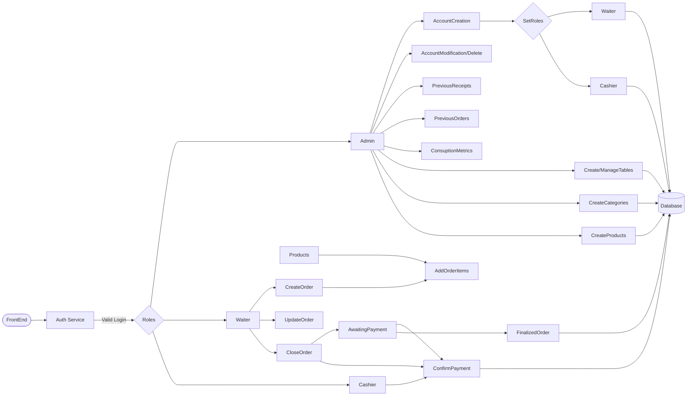

Restaurant Management Dashboard

///
⚠️ Backend concluído.
🚧 Frontend em desenvolvimento.
///

Restaurant Management Dashboard é uma aplicação full-stack desenvolvida para gerenciamento de restaurantes, permitindo o controle de mesas, pedidos, produtos, categorias, pagamentos e usuários através de diferentes níveis de acesso.

O projeto foi desenvolvido utilizando ASP.NET Core no backend e React no frontend, com foco em arquitetura limpa, autenticação segura e organização de regras de negócio.

Principais funcionalidades
Autenticação JWT com Refresh Token Rotation
Controle de acesso baseado em Roles (Admin, Waiter e Cashier)
Gerenciamento de usuários
Gerenciamento de produtos e categorias
Gerenciamento de mesas
Gerenciamento de pedidos
Gerenciamento de pagamentos
Dashboard de métricas do restaurante
Logging estruturado com Serilog
Rate Limiting
Tratamento global de exceções
Tecnologias Utilizadas
Backend
ASP.NET Core
Entity Framework Core
SQL Server
JWT Authentication
Serilog
ASP.NET Identity Password Hasher
Frontend
React
TypeScript
Material UI
Arquitetura

O backend foi desenvolvido seguindo uma arquitetura modular, separando responsabilidades entre:

API
Application
Domain
Repository

O projeto utiliza DTOs, Services, Entity Configurations e autenticação baseada em Claims e Roles para manter a aplicação organizada e escalável.

FLOWCHART

